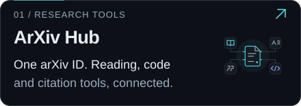
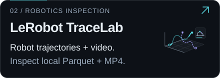
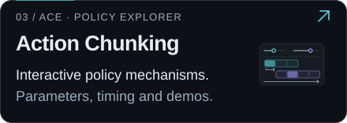
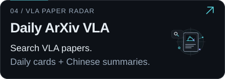

<picture>
  <source media="(max-width: 600px)" srcset="./img/banners/robotics-mobile.svg" />
  
</picture>

  
  
  
  
  

  👋 Hi, I'm Wenyao — an embodied AI researcher. 
  🤖 VLA · WAM · Reinforcement Learning · Action Chunking · Real-Robot Learning 
  <a href="https://ev.buaa.edu.cn/">&nbsp;M.Sc. @ BUAA</a> · Beijing, China 
  Experience across
  <a href="https://www.antgroup.com/en">&nbsp;Ant Group</a> ·
  <a href="https://gigaai.cc/">&nbsp;GigaBrain</a> ·
  <a href="https://www.noetixrobotics.com/en/">&nbsp;Noetix</a> ·
  <a href="https://cybopal.com/">&nbsp;Cybopal</a>

<h3 align="left">🚀 Open-source lab · Click a card to explore</h3>

  
  
  
  

  Source code ·
  <a href="https://github.com/Peaceful-World-X/ArXivHub">ArXiv Hub</a> ·
  <a href="https://github.com/Peaceful-World-X/LeRobot_TraceLab">TraceLab</a> ·
  <a href="https://github.com/Peaceful-World-X/Action-Chunking-Survey">Action Chunking</a> ·
  <a href="https://github.com/Peaceful-World-X/daily-arxiv-vla">Daily VLA</a>

  🛠️ Tools · <code>Python</code> · <code>PyTorch</code> · <code>C++</code> · <code>LeRobot</code> · <code>MuJoCo</code> · <code>Linux</code> · <code>Docker</code> · <code>Git</code>

<!-- Top badges use native 20px SVGs. Avoid density descriptors in external srcset URLs: GitHub's image proxy may treat them as part of the URL. -->
<!-- Total stars are provided by Shields.io: received stars across owned public repositories, including forks. Service and GitHub image caches may delay updates. -->
<!-- Profile views are provided by visitor-badge.laobi.icu: image loads, not unique visitors. GitHub image caching and service availability affect the counter. -->
